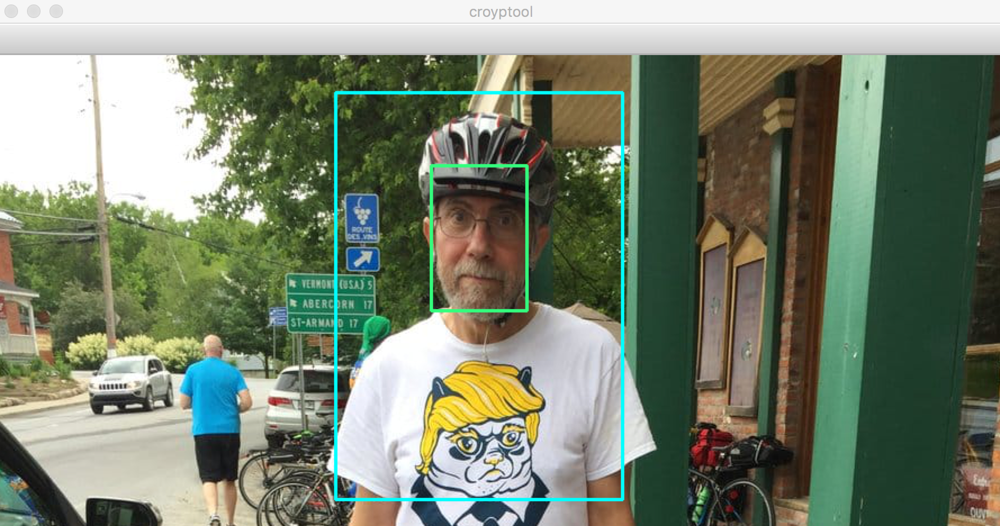

# croyptool

Croyptool is a simple [OpenCV](https://github.com/opencv/opencv)-based script that uses tensorflow object detection API to aid with semiautomatic cropping of images containing faces. Useful for StyleGAN experiments.

Pre-trained model by [aodiwei](https://github.com/aodiwei/Tensorflow-object-detection-API-for-face-detcetion) is employed for face detection.

## Quick start

Install opencv, tensorflow and the usual suspects, then:

`croyptool.py <source images dir> <cropped images dir>`

While running,

    space bar: accept suggested cropping, save cropped image
    esc: reject and continue
    q: reject and quit croytool

For scaling and squaring, use imagick:

`for i in *.jpg; do convert $i  -resize 1024x1024 ../resized/$i; done`

`for i in *.jpg; do convert $i  -gravity center -background white -extent 1024x1024 ../squared/$i; done`
